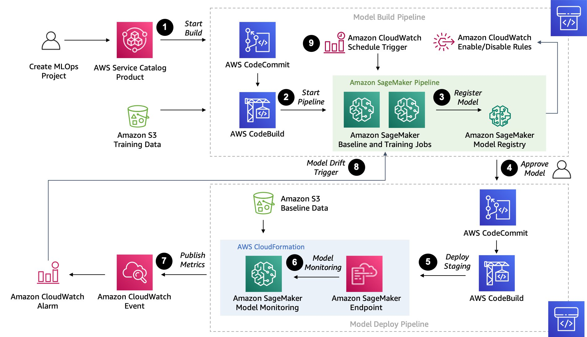

# Project 03

---

Scope of this project is to build on top what we have learned in the class. In the class different algorigthms, both supervised and unsupervised of type classification and regression were covered. 

In this project, we will excercise how models are built using modern MLOPS practices using modern cloud data platform - mainly AWS Sagemaker. 

Topics that will be covered are:

- Feature Store and Feature Engineering
- Model Monitoring
- Model Registry
- Experiments Management
- ML Pipelines
- Automl
- AI explainability
- Inference

---

### Feature store
Features are  all the data that we use to create model. Feature engineering is the process of collecting the data from various sources and transforming it to make it ready to build model on top. It is basically an ETL process . 
Feature store is where we store the feature data. Feature store and engineering encourages reuse of code and  data.  It also helps bring in  standardization on the ETL process. Feature store usually provide search and discovery(data catalog)

There are 2 types of features:
- Online feature 
- Offline feature. 

Online feature support faster lookup and are used for real time inference  whereas offline feature are slow but efficient for bulk batch training and batch inference 

### Experiment Management

Experiment is where a data scientist tries different things eg different model, different transformation, different hyper parameters etc to come up with most effective model. Experiment management is a process of organizing and tracking experiment metadata like code version, data version, metrics, hyperparameters etc. It allows users  to compare different models via different metrics, charts/plot, logs. 

  
### Model Registry
Model registry is where the models are stored. Every experiment produces a model. Each model has different metrics, different bias report etc. Models are usually versioned and only approved models are deployed . 

### Pipeline
Once a model is created, there are set of things that should happen. Such as check the quality of the model. bias check, load testing, a/b testing, rollback if necessary, model approval for production deployment. We need to be able to do this in consistent and automated way. That is what pipeline does

This is an example of cicd pipeline used in this project




### Inference
In the real world, models need to wrapped around an API so that it can be easily invoked. There is a lot that goes into building production quality apis. Data scientist should not have to worry about any of that and  creating an api should be super simple: one click deployment. All ml cloud platform provide that. They also provide logging/metrics/monitoring/infrastucture/autoscaling/serverless deployment
  
### Model Monitoring
Inference need to be monitored. if there is changes in data quality, or data itself changed, we might have to retrain the model.

### Automl
All the ml platform normally provide some kind of auto ml functionality which avoid a lot of work for data scientists. 

---

## Implementation

To test these all these capabilities, we are using abalone project. Abalone is a kind of shell fish. It has list of attributes like length, width, different kind of weight(like weight of meat, guts, weigth after they dry etc).  The goal here is to figure out the age of the abalone. Age is reflected by the rings on their shell. But counting the ring is hard, it requires cutting of shell in certain way, staining it for better visibility and then counting the rings. This whole process is very time-consuming whereas gathering all those dimensions mention earlier is much easier.

Idea here is to use other dimensions to predict the age of the shellfish

## Dataset for the  Abalone Pipeline

The dataset used is the [UCI Machine Learning Abalone Dataset](https://archive.ics.uci.edu/ml/datasets/abalone). The aim for this task is to determine the age of an abalone (a kind of shellfish) from its physical measurements. At the core, it's a regression problem. 
    
The dataset contains several features - length (longest shell measurement), diameter (diameter perpendicular to length), height (height with meat in the shell), whole_weight (weight of whole abalone), shucked_weight (weight of meat), viscera_weight (gut weight after bleeding), shell_weight (weight after being dried), sex ('M', 'F', 'I' where 'I' is Infant), as well as rings (integer).

## ModelBuild Project Artifact Description

`modelbuild` folder contains all the code to build a model. There are 2 ways we are building model. First is using xgboost via pipeline code and another is using autopilot

A description of artifacts is provided below

```
|-- codebuild-buildspec.yml
|-- CONTRIBUTING.md
|-- pipelines
|   |-- abalone
|   |   |-- evaluate.py
|   |   |-- __init__.py
|   |   |-- pipeline.py
|   |   `-- preprocess.py
|   |-- get_pipeline_definition.py
|   |-- __init__.py
|   |-- run_pipeline.py
|   |-- _utils.py
|   `-- __version__.py
|-- README.md
|-- sagemaker-pipelines-project.ipynb
|-- autopilot
|   |-- AutopilotCandidateDefinitionNotebook.ipynb
|   |-- AutopilotDataExplorationNotebook.ipynb
|   |-- candidate_feature_engineering.py
|   |-- report.pdf
|   `-- AutopilotSetup.ipynb
|-- setup.cfg
|-- setup.py
|-- tests
|   `-- test_pipelines.py
`-- tox.ini
```


This file contains the instructions needed to kick off an execution of the SageMaker Pipeline in the CICD system (via CodePipeline). This file has the fields defined for naming the Pipeline, ModelPackageGroup etc. 

```
|-- codebuild-buildspec.yml
```

Pipeline artifacts includes a pipeline module defining the required `get_pipeline` method that returns an instance of a SageMaker pipeline, a preprocessing script that is used in feature engineering, and a model evaluation script to measure the Mean Squared Error of the model that's trained by the pipeline.  `pipelines/pipelines.py` contains the core business logic

```
|-- pipelines
|   |-- abalone
|   |   |-- evaluate.py
|   |   |-- __init__.py
|   |   |-- pipeline.py
|   |   `-- preprocess.py

```

Utility modules for getting pipeline definition jsons and running pipelines:

```
|-- pipelines
|   |-- get_pipeline_definition.py
|   |-- __init__.py
|   |-- run_pipeline.py
|   |-- _utils.py
|   `-- __version__.py
```

Python package artifacts:
```
|-- setup.cfg
|-- setup.py
```


Autopilot artifacts:

`AutopilotSetup.ipynb` sets up an autopilot experiment. `AutopilotCandidateDefinitionNotebook.ipynb` and `AutopilotDataExplorationNotebook` are the notebooks generated by the autopilot. `report.pdf` is AI Explainalibility report. `candidate_feature_engineering.py` is the feature engineering pipeline generated by autopilot

```
|-- autopilot
|   |-- AutopilotCandidateDefinitionNotebook.ipynb
|   |-- AutopilotDataExplorationNotebook.ipynb
|   |-- candidate_feature_engineering.py
|   |-- report.pdf
|   `-- AutopilotSetup.ipynb
```


## ModelDeploy Project 

This folder is for deploying an realtime inference Endpoint infrastructure. 
This code repository has the code to find the latest approved ModelPackage for the associated ModelPackageGroup and automaticaly deploy it to the Endpoint on detecting a change (`build.py`). This code repository also defines the CloudFormation template which defines the Endpoints as infrastructure. It also has configuration files associated with `staging` and `prod` stages. 

Upon triggering a deployment, the CodePipeline pipeline will deploy 2 Endpoints - `staging` and `prod`. After the first deployment is completed, the CodePipeline waits for a manual approval step for promotion to the prod stage. 


```
|-- codedeploy
|   |-- build.py
|   |-- buildspec.yml
|   |-- endpoint-config-template.yml
|   |-- prod-config.json
|   |-- staging-config.json
|   `-- test
|       |-- test.py
|       `-- buildspec.yml
```


`buildspec.yml`
 - this file is used by the CodePipeline's Build stage to build a CloudFormation template.

`build.py`
 - this python file contains code to get the latest approve package arn and exports staging and configuration files. This is invoked from the Build stage.

`endpoint-config-template.yml`
 - this CloudFormation template file is packaged by the build step in the CodePipeline and is deployed in different stages.

`staging-config.json`
 - this configuration file is used to customize `staging` stage in the pipeline. You can configure the instance type, instance count here.

`prod-config.json`
 - this configuration file is used to customize `prod` stage in the pipeline. You can configure the instance type, instance count here.

`test\buildspec.yml`
  - this file is used by the CodePipeline's `staging` stage to run the test code of the following python file

`test\test.py`
  - this python file contains code to describe and invoke the staging endpoint. You can customize to add more tests here.